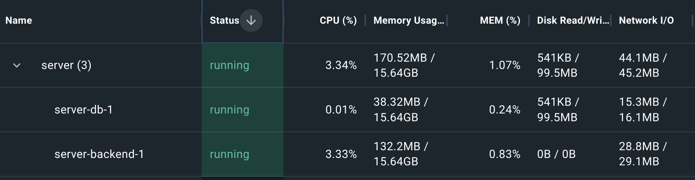

# TermiDator
a killer solution

## Style Guide
- Black formatter

## Architecture
- backend
  - REST server that handles data streaming and triggers batch processing jobs
- Jupyter Notebooks
  - data visualization and analysis tool
- db
  - Postgres database (datalake)

---
|Technology|Pros|Cons|
|----------|----|----|
|Postgres|on-prem: platform independent|it's an OLTP databse, not OLAP because it's a row DB|
|Python|Easy to program and understand|slow, interpreted, huge Heap allocation|
|Django|Easy DB Model building and migration|It's ORM is not designed for DataStreaming nor DWH building, performance is lacking|
|Jupyter Notebooks|Ease of use, Open Source, easy to integrate|Not the most professional data visualization|
|PostGIS|Easy plug and play extension for Postgres|Supports up to 4D vectors|

PS: if we trully wanted to scale we'd directly upload to a cloud provider and do stream and batch processing with Spark (orchestrated with Ariflow most probably) on top of a columnar DataBase

## Alternatives we looked at
- https://github.com/pgvector/pgvector
- https://theorangeone.net/posts/django-orm-performance/
- https://docs.djangoproject.com/en/dev/topics/db/sql/#executing-custom-sql-directly
- https://pypi.org/project/beam-postgres/
- https://www.psycopg.org/docs/

# Performance:
- Machine specs: 
  - Intel® Core™ i7-7700HQ CPU @2.80GHz,  8 threads
  - 32GB RAM @2667 MT/s, 1.2V
- Resources for docker QUEMU VM
  - 6 threads
  - 16GB RAM
  - 1,5GB Swap
  - 96GB Disk
- Idle resource utilization

---
During streaming of amazon_metadata
- /server/backend 

- /server/backend/data/streamer.py

- Overall:

---
During streaming of amazon_reviews
- /server/backend 

- /server/backend/data/streamer.py

for 55826 entries

---
During streaming of emotion analysis of reviews
- /server/backend 

- /server/notebooks/nlp/emotions_classifier.py

Time: ~ 110-140 ms per entry

---