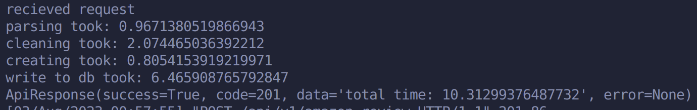

# <u>***TermiDator***</u>
#### *a killer solution*

### Style Guide
- Black formatter

## Architecture
- backend
  - REST server that handles data streaming and triggers batch processing jobs
- Jupyter Notebooks
  - data visualization and analysis tool
- db
  - Postgres database (datalake)

---
|Technology|Pros|Cons|
|----------|----|----|
|Postgres|on-prem: platform independent|it's an OLTP databse, not OLAP because it's a row DB|
|Python|Easy to code and understand|slow, interpreted, huge Heap allocation|
|Django|Easy DB Model building and migration|It's ORM is not designed for DataStreaming nor DWH building, performance is lacking|
|Jupyter Notebooks|Ease of use, Open Source, easy to integrate|Not the most professional data visualization|
|PostGIS|Easy plug and play extension for Postgres|Supports up to 4D vectors|

PS: if we trully wanted to scale we'd directly upload to a cloud provider and do stream and batch processing with Spark (orchestrated with Ariflow most probably) on top of a columnar DB

## Alternatives we looked at
- https://github.com/pgvector/pgvector
- https://theorangeone.net/posts/django-orm-performance/
- https://docs.djangoproject.com/en/dev/topics/db/sql/#executing-custom-sql-directly
- https://pypi.org/project/beam-postgres/
- https://www.psycopg.org/docs/

# Performance:
- Machine specs: 
  - Intel® Core™ i7-7700HQ CPU @2.80GHz,  8 threads
  - 32GB RAM @2667 MT/s, 1.2V
- Resources for docker QEMU VM
  - 6 threads
  - 16GB RAM
  - 1,5GB Swap
  - 200GB Disk
- Idle resource utilization (100% CPU means 1 thread)

---
During streaming of amazon_metadata
- Time (seconds)
  - /server/backend 
  
  - /server/backend/data/streamer.py
  
- Resources
  - /server/backend 
  
  - /server/backend/data/streamer.py
  
  - Overall:
  

(most of the payload goes straight to the garbage)

---
During streaming of amazon_reviews
- Time (seconds) for 55826 entries 
  - /server/backend 
  
  - /server/backend/data/streamer.py
  
- Resources
  - /server/backend
  
  - /server/backend/data/streamer.py
  
  - Overall
  

---
During streaming of emotion analysis of reviews
- Time: 
  - ~ 10 ms per entry or even less, couldn't measure properly because of asyncio
- Resources
  - /server/backend 
  
  - /server/notebooks/nlp/emotions_classifier.py
  
  - Overall:
  

---
During updating of PCA embeddings for review emotions
- Time: ~ 12 ms per asin. ~ 3 minutes total for ~ 150k emotionally pre-processed reviews. Didn't even bother to use asyncio

---
Fetching closest (knn) review to the average for that asin
- Time for an asin with 2562 reviews processed
  - /server/backend 
  
  - /server/notebooks/utils.py
  
